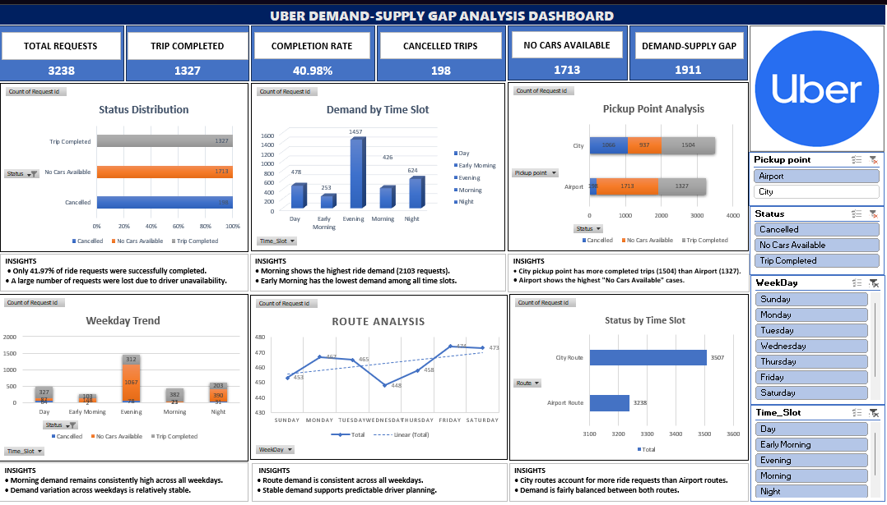

# 🚖 Uber Demand–Supply Gap Analysis
## 📊 Dashboard Preview

## 📌 Project Overview

This project analyzes Uber ride request data to identify demand–supply gaps, ride completion performance, cancellation trends, driver availability issues, and customer demand patterns.

The analysis is performed using **Microsoft Excel, Python, and SQL** to generate business insights and data-driven recommendations for improving operational efficiency.

---

## 🛠️ Tools & Technologies

- Microsoft Excel
- Python (Pandas, Matplotlib)
- SQL
- Google Colab

---

## 📊 Key Performance Indicators (KPIs)

| KPI | Value |
|------|---------|
| Total Ride Requests | **6745** |
| Completed Trips | **2831** |
| Cancelled Trips | **1264** |
| No Cars Available | **2650** |
| Completion Rate | **41.97%** |

---

## 🔍 Business Insights

- Morning time slot has the highest ride demand.
- Driver shortages create a significant demand–supply gap.
- Failed rides exceed completed rides.
- City pickup points generate the highest number of requests.

---

## 💡 Business Recommendations

- Increase driver availability during peak hours.
- Introduce peak-hour driver incentives.
- Improve airport and city driver allocation.
- Implement demand forecasting models.

---

## 📂 Repository Contents

- 📊 Excel Dashboard
- 🐍 Python Data Analysis Notebook
- 🗄 SQL Business Queries
- 📄 Final Project Report
- 📁 Dataset

---

## 🎯 Skills Demonstrated

- Data Cleaning
- Exploratory Data Analysis (EDA)
- Data Visualization
- SQL Analysis
- Dashboard Development
- Business Intelligence
- Business Problem Solving

---

## 👨‍💻 Author

**Yashvardhan Yadav**

MBA (Data Science & AI)

Aspiring Data Analyst
